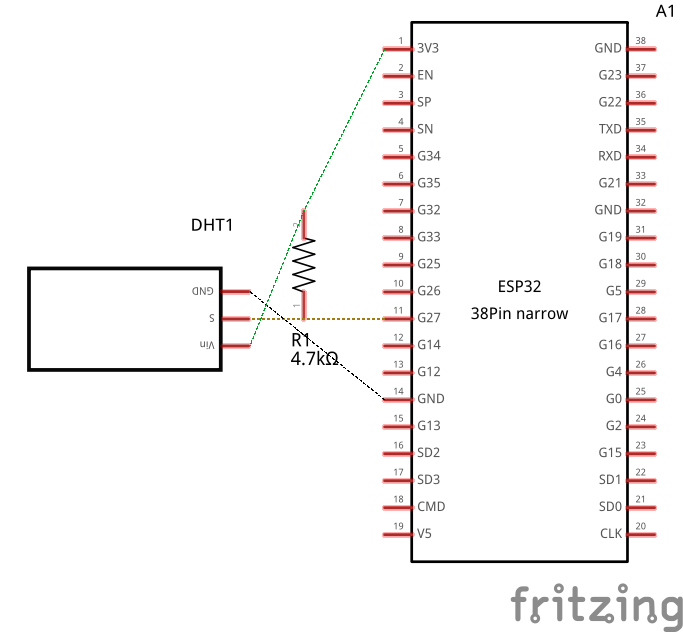
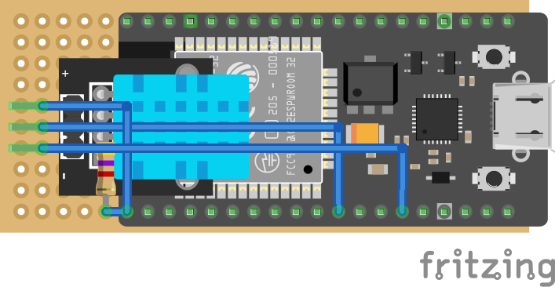

# About

ha-esphome-dht11 is a project to allow me to scatter remote temperature and humidity sensors around my house.

# Components

- [An ESP32 DevKit board](https://www.amazon.com/dp/B0DT3RTK9D)
- [DHT11 temperature/humidity sensor](https://www.amazon.com/dp/B0DTKB16MD)
- [4.7k Ohm resistor](https://www.amazon.com/dp/B08FD1XVL6) (Probably best value overall.)
- [perfboard](https://www.amazon.com/dp/B0DBZ1BXFZ)

## Schematic

## Layout

# Installation

You can use the button below to install the pre-built firmware directly to your device via USB from the browser.

<esp-web-install-button manifest="firmware/project-template.manifest.json"></esp-web-install-button>

